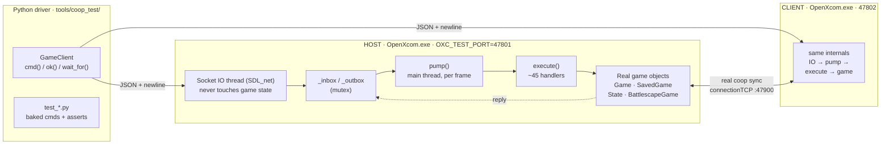

# Add a live coop test harness (autonomous two-client testing)

## Why

There's currently no automated way to test coop end-to-end: every change to the netcode is validated by hand, two people clicking through a session. This PR adds a live test harness, an in-game command server plus Python drivers that spawn real game instances, drive them through menus/saves/lobby/geoscape/battle, and assert that host and client stay in sync. It runs unattended, needs no external mod and no pre-existing save, and builds on a stock checkout.

## What the harness is

An in-game command server (`src/CoopMod/TestServer.{h,cpp}`, active only when the `OXC_TEST_PORT` env var is set, so zero footprint in normal play) that a Python driver talks to over newline-delimited JSON on `127.0.0.1:<port>`. It lets a script read game state and drive a real running client, and lets those interactions be baked into automated functional tests across two live coop instances.



Key property: the socket thread does I/O only; every command executes on the main thread via the per-frame `pump()`, so all state access is race-free. Handlers invoke the real `State` methods (`Profile::buttonOK`, `BuildNewBaseState::placeAt`, `UnitWalkBState`, …) rather than faking SDL input, so a command exercises the exact path a human click would. The two game instances sync to each other over the real `connectionTCP` coop link, which is the actual product under test; the tests assert host-vs-client agreement to catch replication desyncs.

## What's in this PR

- `src/CoopMod/TestServer.{cpp,h}`: the in-game command server (~45 command handlers covering session/introspection, lobby bootstrap, geoscape play, battlescape combat, transfer/UI).
- `tools/coop_test/`: the Python drivers plus `harness.py` (the `GameClient` socket wrapper and hermetic `make_user_dir`), and a `README.md` covering build/run, architecture, isolation, the test list, and the command catalog.
- Minimal wiring in existing files: a per-frame `TestServer::pump()` call in `Game::run()`, a read-only `Game::getStates()` accessor, CMake / vcxproj(.filters) registration, and a few public-ised `State` entry points so the harness can drive real handlers instead of synthesizing input.
- Small read-only test hooks on existing coop code so the harness can inspect it: `ServerList::getServerCombo()`, `DisableableComboBox::getOptionCount()`/`getOptionLabel()`, and a `g_txDropCount` drop counter incremented at the two existing "TX queue full" sites in `connectionTCP.cpp` (pairs with the geoscape-sync conflation fix already on `main`).

This PR is opt-in: everything runs behind `OXC_TEST_PORT`; with the var unset the server never starts and the added surface is inert.

## What the tests cover

The harness drives the coop features already on `main` (soldier ownership transfer, the multi-rendezvous server browser, the geoscape-sync conflation / TX-queue path), so every test ships functional against the real code. No conditional compilation and no feature flags.

## Runs on any machine (hermetic)

`make_user_dir()` writes a fresh minimal `options.cfg` that pins the stock `xcom1` master (no external mods), with intro/audio/mouse-capture off and a small 640×400 window (so it doesn't grab focus while running). OpenXcom defaults every unspecified key and resolves data (`UFO`/`TFTD`/`standard`/`common`) from the exe's own dir. No local config is read; no pre-existing save is required. The tests bootstrap a brand-new campaign each run.

## Verification

- Full serial MSBuild `Release|x64` returns `0 Error(s)`; `OpenXcom.exe` links with no unresolved externals.
- `boot_check` on a fresh generated config brings up active mods `[xcom1 v8.6.0]` only, display 640×400, data loaded, 0 errors.
- Full suite run from hermetic dirs; every test spawned instances and connected on both ports (isolation confirmed):

| Test | Coverage |
|---|---|
| `boot_check` | single-instance smoke / install check |
| `test_transfer_fresh` / `test_bug_fixes` / `test_transfer_rollback` | soldier ownership transfer, owner resolution, notices, host-save-authority rollback |
| `test_server_browser` | rendezvous-server combobox state |
| `test_txq_flood` | TX-queue-drop path under a flood |
| `test_geoscape_sync` | geoscape host/client sync; currently reports a divergence, a real finding surfaced by the harness, worth triage |

Every test ships functional against the features now on `main`. The one caveat is `test_geoscape_sync` flagging a sync divergence, which is the harness doing its job.

## How to run

```
# build once (serial; the project can exhaust the compiler heap with /m)
MSBuild src/OpenXcom.2010.sln /p:Configuration=Release /p:Platform=x64

# any test: spawns real windowed instances and tears them down
python tools/coop_test/test_geoscape_sync.py
python tools/coop_test/boot_check.py
```

## Notes / limitations

- The Python driver is Windows-only for now (SDL_net plus `subprocess`/`STARTUPINFO` window placement); the in-game server itself is portable.
- Entirely opt-in: no behavior change unless `OXC_TEST_PORT` is set.
- Feature-gated tests are included so they're ready when their features land; they no-op cleanly until then.
